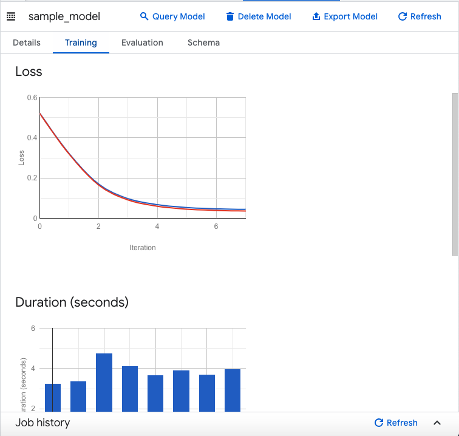
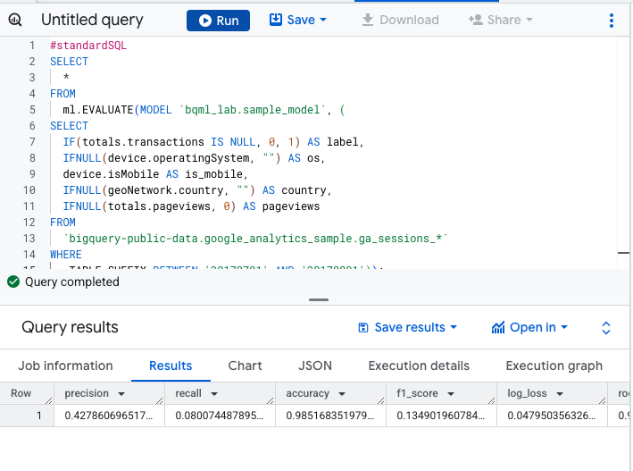

# GCP-LAB-Getting-Started-with-BigQuery-ML
Getting Started with BigQuery ML

#### Overview

BigQuery ML enables users to create and execute machine learning models in BigQuery using SQL queries. The goal is to democratise machine learning by enabling SQL practitioners to build models using their existing tools and to increase development speed by eliminating the need for data movement.

There is an available ecommerce dataset that has millions of Google Analytics records for the Google Merchandise Store loaded into BigQuery. In this lab, you use this data to create a model that predicts whether a visitor will make a transaction.

###### What you'll learn
In this lab, you learn how to:

. Create BigQuery datasets
. Create, evaluate, and use machine learning models in BigQuery


###### Prerequisite
To maximize your learning you should have a basic knowledge of SQL or BigQuery.


##### Setup

###### Open the BigQuery console
1. In the Google Cloud Console, select Navigation menu > BigQuery.

The Welcome to BigQuery in the Cloud Console message box opens. This message box provides a link to the quickstart guide and the release notes.

2. Click Done.
The BigQuery console opens.

### Task 1. Create a dataset

1. To create a dataset, click on the View actions icon next to your project ID and select Create dataset.
Create dataset option

2. Next, name your Dataset ID bqml_lab and click Create dataset.


### Task 2. Create a model
Now, move on to your task!

1. Go to BigQuery EDITOR, type or paste the following query to create a model that predicts whether a visitor will make a transaction:

```
#standardSQL
CREATE OR REPLACE MODEL `bqml_lab.sample_model`
OPTIONS(model_type='logistic_reg') AS
SELECT
  IF(totals.transactions IS NULL, 0, 1) AS label,
  IFNULL(device.operatingSystem, "") AS os,
  device.isMobile AS is_mobile,
  IFNULL(geoNetwork.country, "") AS country,
  IFNULL(totals.pageviews, 0) AS pageviews
FROM
  `bigquery-public-data.google_analytics_sample.ga_sessions_*`
WHERE
  _TABLE_SUFFIX BETWEEN '20160801' AND '20170631'
LIMIT 100000;
```

2. Click RUN.


Here the visitor's device's operating system is used, whether said device is a mobile device, the visitor's country and the number of page views as the criteria for whether a transaction has been made.

In this case, bqml_lab is the name of the dataset and sample_model is the name of the model. The model type specified is binary logistic regression. In this case, label is what you're trying to fit to.

Note: If you're only interested in 1 column, this is an alternative way to setting input_label_cols.
The training data is being limited to those collected from 1 August 2016 to 30 June 2017. This is done to save the last month of data for "prediction". It is further limited to 100,000 data points to save some time.

Running the CREATE MODEL command creates a Query Job that will run asynchronously so you can, for example, close or refresh the BigQuery UI window.


##### (Optional) Model information & training statistics
If interested, you can get information about the model by expanding bqml_lab dataset and then clicking the sample_model model in the UI. Under the Details tab you should find some basic model info and training options used to produce the model. Under Training, you should see a table either a table or graphs, depending on your View as settings:





### Task 3. Evaluate the model
Replace the previous query with the following and then click Run:

```
#standardSQL
SELECT
  *
FROM
  ml.EVALUATE(MODEL `bqml_lab.sample_model`, (
SELECT
  IF(totals.transactions IS NULL, 0, 1) AS label,
  IFNULL(device.operatingSystem, "") AS os,
  device.isMobile AS is_mobile,
  IFNULL(geoNetwork.country, "") AS country,
  IFNULL(totals.pageviews, 0) AS pageviews
FROM
  `bigquery-public-data.google_analytics_sample.ga_sessions_*`
WHERE
  _TABLE_SUFFIX BETWEEN '20170701' AND '20170801'));
```


If used with a linear regression model, the above query returns the following columns:

. mean_absolute_error, mean_squared_error, mean_squared_log_error,
. median_absolute_error, r2_score, explained_variance.

If used with a logistic regression model, the above query returns the following columns:

. precision, recall
. accuracy, f1_score
. log_loss, roc_auc

Please consult the machine learning glossary or run a Google search to understand how each of these metrics are calculated and what they mean.

You'll realize the SELECT and FROM portions of the query are identical to that used during training. The WHERE portion reflects the change in time frame and the FROM portion shows that you're calling ml.EVALUATE.




### Task 4. Use the model
Predict purchases per country
With this query you will try to predict the number of transactions made by visitors of each country, sort the results, and select the top 10 countries by purchases:

. Replace the previous query with the following and then click Run:

```
#standardSQL
SELECT
  country,
  SUM(predicted_label) as total_predicted_purchases
FROM
  ml.PREDICT(MODEL `bqml_lab.sample_model`, (
SELECT
  IFNULL(device.operatingSystem, "") AS os,
  device.isMobile AS is_mobile,
  IFNULL(totals.pageviews, 0) AS pageviews,
  IFNULL(geoNetwork.country, "") AS country
FROM
  `bigquery-public-data.google_analytics_sample.ga_sessions_*`
WHERE
  _TABLE_SUFFIX BETWEEN '20170701' AND '20170801'))
GROUP BY country
ORDER BY total_predicted_purchases DESC
LIMIT 10;
```

This query is very similar to the evaluation query demonstrated in the previous section. Instead of ml.EVALUATE, you're using ml.PREDICT and the BigQuery ML portion of the query is wrapped with standard SQL commands. For this lab you're interested in the country and the sum of purchases for each country, so that's why SELECT, GROUP BY and ORDER BY. LIMIT is used to ensure you only get the top 10 results.


###### Predict purchases per user

Here is another example. This time you will try to predict the number of transactions each visitor makes, sort the results, and select the top 10 visitors by transactions:

. Replace the previous query with the following and then click Run:

```
#standardSQL
SELECT
  fullVisitorId,
  SUM(predicted_label) as total_predicted_purchases
FROM
  ml.PREDICT(MODEL `bqml_lab.sample_model`, (
SELECT
  IFNULL(device.operatingSystem, "") AS os,
  device.isMobile AS is_mobile,
  IFNULL(totals.pageviews, 0) AS pageviews,
  IFNULL(geoNetwork.country, "") AS country,
  fullVisitorId
FROM
  `bigquery-public-data.google_analytics_sample.ga_sessions_*`
WHERE
  _TABLE_SUFFIX BETWEEN '20170701' AND '20170801'))
GROUP BY fullVisitorId
ORDER BY total_predicted_purchases DESC
LIMIT 10;
```


### Task 5. Test your understanding

Below are multiple choice questions to reinforce your understanding of this lab's concepts. Answer them to the best of your abilities.

1. BigQuery is a fully-managed enterprise data warehouse that enables super-fast SQL queries.

Yes

2. Which option best describes what BigQuery ML does?

Creates and executes machine learning models in BigQuery using standard SQL queries.


##### Congratulations!

You used BigQuery ML to create a binary logistic regression model, evaluate the model, and use the model to make predictions.

